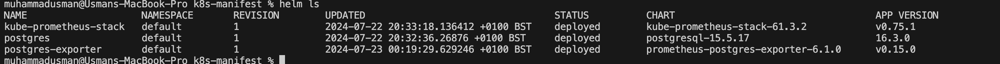
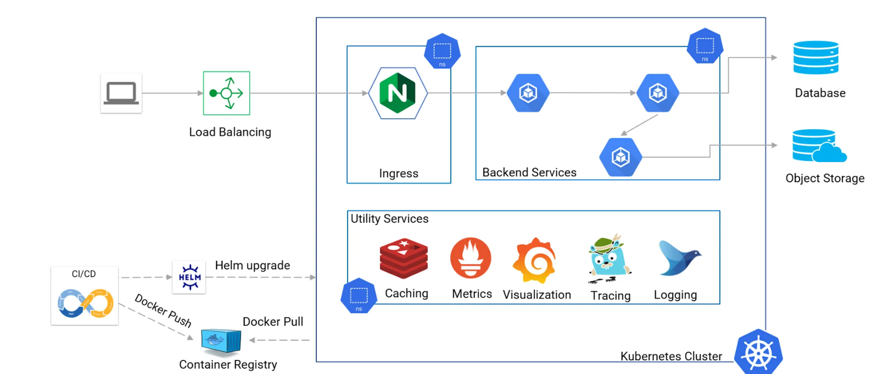

For K8s Installation , I have used AWS eks Cluster, IF you want to test locally you can use Minikube 

Brew install minikube 
minikubse start

kubectl create ns project-plato
kubectl apply -f k8s-manifest/backend.yaml -n project-plato

Apply the db1 and db2 deployments:
kubectl apply -f k8s-manifest/db1.yaml -n project-plato
kubectl apply -f k8s-manifest/db2.yaml -n project-plato

Apply the services for db1 and db2:
kubectl apply -f k8s-manifest/db-service.yaml -n project-plato

Apply the network policy:
kubectl apply -f k8s-manifest/np.yaml -n project-plato

Apply the secret for db2:
kubectl apply -f k8s-manifest/secret.yaml -n project-plato

Install PostgreSQL Exporter using Helm
Add the Prometheus community Helm chart repository:
helm repo add prometheus-community https://prometheus-community.github.io/helm-charts
helm repo update

Install the PostgreSQL exporter:
helm install postgres-exporter prometheus-community/prometheus-postgres-exporter --set postgresql.enabled=false -n project-plato
Create a service for the PostgreSQL exporter:
kubectl apply -f k8s-manifest/postgres-exporter-svc.yaml -n project-plato

Install Prometheus and Grafana using Helm
Add the stable Helm chart repository:
helm repo add stable https://charts.helm.sh/stable
helm repo update

Install Prometheus:
helm install prometheus stable/prometheus -n project-plato

Install Grafana:
helm install grafana stable/grafana --set adminPassword='usman-testing' -n project-plato

Configure Prometheus to Scrape PostgreSQL Exporter
Edit the Prometheus ConfigMap:
kubectl edit configmap prometheus-server -n project-plato

Add the following scrape configuration under scrape_configs:
yaml
scrape_configs:
  - job_name: 'postgres_exporter'
    static_configs:
      - targets: ['postgres-exporter.project-plato.svc.cluster.local:9187']
        labels:
          service: 'postgres-exporter'

Save the ConfigMap and restart the Prometheus pods:
ubectl delete pod -l app=prometheus-server -n project-plato

Verification
Verify Readiness and Liveness Probes
Check the status of the backend pod:
kubectl get pods -n project-plato -l app=backend

Describe the backend pod to see the status of readiness and liveness probes:
kubectl describe podbusybox-6hs68981q -n project-plato

Verify Network Policy
Verify that the backend pod can only communicate with db1 and db2 on specified ports:

kubectl exec -it busybox-6hs68981q -n project-plato -- nc -zv db1-project-plato.svc.cluster.local 6379
kubectl exec -it busybox-6hs68981q -n project-plato -- nc -zv db2-project-plato.svc.cluster.local 5432

Verify Secret
Check if the environment variables are set in the db2 pod:
kubectl exec -it db2-qur34s2 -n project-plato -- env | grep DB_

Verify PostgreSQL Exporter in Prometheus
Access the Prometheus web UI (usually at localhost:9090).

Navigate to Status > Targets to see if the PostgreSQL exporter target is listed and being scraped successfully.
In the Prometheus web UI, go to Graph and run a query to check if metrics from the PostgreSQL exporter are available. For example:
prometheus

pg_up

Access Grafana
Get the Grafana admin password:
bash
Copy code
kubectl get secret --namespace project-plato grafana -o jsonpath="{.data.admin-password}" | base64 --decode ; echo
Port-forward to access the Grafana UI:
bash
Copy code
kubectl port-forward svc/grafana 3000:80 -n project-plato
Access Grafana at http://localhost:3000 and log in with the admin password.

Infrastructure Plan
Cluster Setup and Management:
- AWS EKS or GKE

Continuous Integration and Continuous Deployment (CI/CD):

- GitHub Actions for CI/CD pipelines for Automate testing, building, and deployment processes to ensure consistency and reliability.

Security Measures:
- Role-Based Access Control (RBAC) to manage permissions.
- network policies to control traffic between pods.
- all secrets are stored securely using Kubernetes Secrets or external solutions like HashiCorp Vault.
- Regularly scan container images for vulnerabilities using tools like Trivy or Aqua Security.

Monitoring and Logging:
- Prometheus and Grafana for metrics collection and visualization.
- ELK stack (Elasticsearch, Logstash, Kibana) or EFK stack (Elasticsearch, Fluentd, Kibana) for centralized logging.
- alerts for critical metrics using Prometheus Alertmanager or an external service like PagerDuty.

Scalability:
- Horizontal Pod Autoscaler (HPA) to scale pods based on metrics like CPU and memory usage.
- Karpenter for Cluster Autoscaler to add or remove nodes based on the demand.

Networking:
- Ingress controller (e.g., NGINX Ingress Controller) to manage external access to the services.
- Virtual Private Cloud (VPC) with subnets and appropriate security groups/firewall rules to control traffic flow.

Storage:
- Persistent Volumes (PV) and Persistent Volume Claims (PVC) for stateful applications.
- AWS EBS

Collaboration and Developer Productivity:
- Helm charts to package Kubernetes applications and manage releases.
- Provide developers with access to development and staging environments that mirror the production setup.
- FluxCD for GitOps-based deployments (i have not used this tool personally)

Technologies and Services
Kubernetes Service: EKS
CI/CD: Jenkins and GitHub Actions
Security: RBAC, Network Policies, HashiCorp Vault
Monitoring and Logging: Prometheus, Grafana, ELK/EFK stack
Scalability: HPA, Karpenter
Networking: NGINX Ingress Controller, VPC
Storage: Persistent Volumes,
Collaboration Tools: Helm, FluxCD

Architecture Diagram
